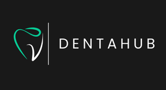
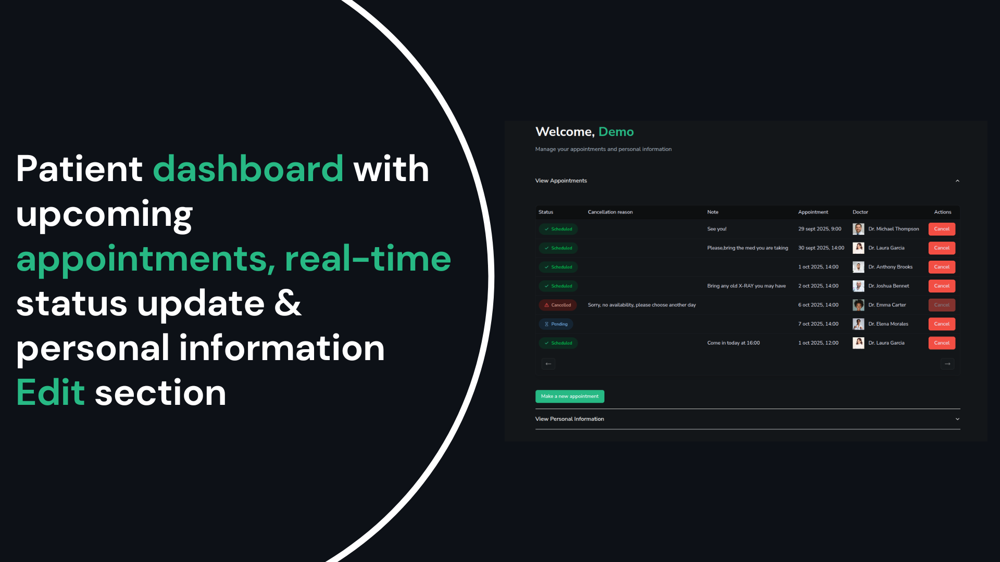

<h1 align="center">
   
</h1>

## 🦷 DentaHub - Modern Dental Appointment System
> **A full-stack dental platform that digitizes patient registration, appointment scheduling and administration.**

[**🎥 Watch Demo Video**](#) <!-- Add your Loom video link here -->

---

## 📋 Table of Contents

- [Demo Access](#-demo-access)
- [Key Features](#-key-features)
- [The Problem](#-the-problem)
- [The Solution](#-the-solution)
- [Tech Stack](#-tech-stack)
- [What I Learned](#-what-i-learned)
- [Future Enhancements](#-future-enhancements)
- [Important Notes](#-important-notes)

---

## 🎭 Demo Access

**Live Demo:** [dentahub.vercel.app](https://dentahub.vercel.app)

### Patient Dashboard
Click the **"Demo Patient"** button on the homepage to instantly access a pre-configured patient account and explore all features.

### Admin Dashboard
1. Click "Admin" in the footer of the homepage
2. Enter passkey: `123456`
3. Explore appointment management features
4. SMS notification is fully set up but not available in Demo mode (see Key Features for screenshots)
   
---

✨ Key Features

  

    
&nbsp;
    

    
&nbsp;
    

 
    

    
&nbsp;
    

    
&nbsp;
    

---

## 🔍 The Problem

After working in customer service for 10 years, including at a dental clinic, I witnessed firsthand the inefficiencies of paper-based patient management systems:

**For Patients:**
- Uncomfortable filling out lengthy forms in waiting rooms under time pressure
- No way to track appointments or update personal information
- Forms could be lost or damaged

**For Clinic Staff:**
- Difficulty reading handwritten patient information
- Time-consuming manual data entry and retrieval
- Risk of losing important patient documents
- No centralized system for appointment management

These pain points inspired me to create a digital solution that improves the experience for both patients and healthcare providers.

---

## ✅ The Solution

**DentaHub** is a modern web application that streamlines the entire patient journey - from registration to appointment management. 

Patients can:
- Complete registration forms at their own pace from any device
- View and manage their appointments in real-time
- Update personal information without clinic visits
- Get instant answers to common dental questions via AI chatbot

Meanwhile, clinic administrators can:
- Manage all appointments from a centralized dashboard
- Confirm or cancel appointments with automated SMS notifications
- Track appointment statistics (scheduled, pending, cancelled)

---

## 🛠 Tech Stack

### Frontend
- **Next.js 15** 
- **TypeScript**
- **Tailwind CSS**
- **shadcn/ui**
- **react-hook-form**
- **Zod**
- 
### Backend & Services
- **Appwrite**
  - Authentication
  - Database (NoSQL)
  - Storage (file uploads)
  - Real-time updates
- **OpenAI API** - AI chatbot integration
- **Twilio** - SMS notifications

### Key Libraries
- **react-datepicker**
- **react-phone-number-input**
- **react-markdown**
- **react-hot-toast**
- **lucide-react**

---
## 🔮 Future Enhancements

While the current version is fully functional, here are planned improvements:

- **Email Verification** - Easy to implement with Appwrite's built-in email service
- **Multi-language Support** - Internationalization for broader accessibility
- **Payment Integration** - Stripe/PayPal for appointment deposits
- **Appointment Reminders** - Automated SMS/email reminders 24 hours before appointments
- **Export Reports** - PDF generation for patient records

---

> [!NOTE]
> **Portfolio Project Disclaimers**

**Admin Passkey Exposure**
The admin passkey (`123456`) is intentionally exposed for demonstration purposes only. In a production environment:
- Passkeys would NEVER be exposed in code or documentation
- Multi-factor authentication would be implemented
- Role-based access control would be enforced
- Admin sessions would have timeout mechanisms

**Privacy & Compliance**
This application demonstrates technical capabilities but is not HIPAA-compliant in its current state. For real-world medical use, additional features would be required:
- HIPAA-compliant data encryption at rest and in transit
- Audit logging for all data access
- Patient consent management specific to jurisdiction
- Data retention and deletion policies
- Business Associate Agreements with third-party services

The current privacy consent system is simplified - each medical institution would need to implement their own specific privacy policies based on:
- Local healthcare regulations
- Institutional policies
- Insurance requirements
- Legal jurisdiction

**Data Security**
- All sensitive data is encrypted by Appwrite
- Files are stored securely with access control
- Authentication tokens are httpOnly cookies
- Environment variables protect API keys

---

## 🤝 Contributing

This is a portfolio project, but feedback and suggestions are welcome! Feel free to:
- Open issues for bugs or feature requests
- Submit pull requests with improvements
- Share ideas for enhancements

---

## 📧 Contact

**Your Name**
- Portfolio: [your-portfolio.com](#)
- LinkedIn: [linkedin.com/in/yourprofile](#)
- Email: your.email@example.com

---

## 📄 License

This project is open source and available under the [MIT License](LICENSE).

---

## 🙏 Acknowledgments

- **shadcn/ui** for the beautiful component library
- **Appwrite** for the robust backend infrastructure
- **Vercel** for seamless deployment
- My 10 years in customer service, which taught me to always prioritize user experience

---

**Built with ❤️ by a developer who understands both sides of the customer service counter**
